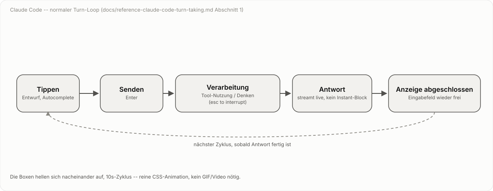
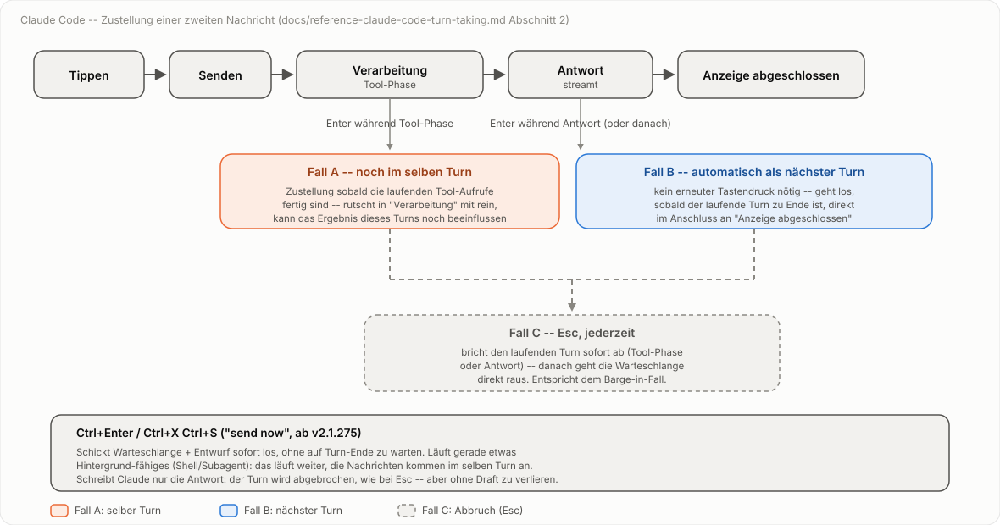

# Referenz: Turn-Taking in Claude Code

Status: Recherche abgeschlossen (2026-10-02), auf Basis der offiziellen
Dokumentation. Dient als externe Referenz für die eigene Zustandsmodell-
Diskussion in `docs/specs/core-dialog-loop.md` (siehe dort Abschnitt 7 zur
noch offenen Frage nach Hintergrund-Ergebnissen und Status-Nachfragen
mitten im Turn) -- kein Teil der `speech-to-speech`-Spezifikation selbst,
sondern Beobachtungsmaterial von einem fremden System.

Quelle: [code.claude.com/docs/en/interactive-mode](https://code.claude.com/docs/en/interactive-mode),
abgerufen 2026-10-02.

## 1. Der normale Ablauf

Ein Turn in Claude Code (interaktiver Terminal-Modus) durchläuft fünf
wiederkehrende Zustände:

1. **Tippen** -- Eingabefeld, Entwurfstext, Autocomplete für `/`-Befehle,
   `@`-Dateipfade, Emoji-Shortcodes.
2. **Senden** -- `Enter` übermittelt den Entwurf; der Turn beginnt.
3. **Verarbeitung** -- Claude nutzt Tools (sichtbar als Tool-Aufruf-Blöcke
   mit Ergebnis) und/oder zeigt einen Denkprozess (sofern Extended Thinking
   aktiv ist). Fußzeile zeigt `esc to interrupt`.
4. **Antwort** -- die Modell-Antwort erscheint.
5. **Anzeige abgeschlossen** -- Eingabefeld wird wieder frei, optional mit
   einem gegrauten Vorschlag für den nächsten Prompt.

Danach beginnt der Zyklus erneut bei 1.

Klickbare Fassung, ein Zustand pro Klick statt Timer:

<object type="image/svg+xml" data="../specs/diagrams/claude-code-turn-loop-clickable.svg" style="width:100%; max-width:1180px; height:420px;">
</object>

### Korrektur einer Annahme: Antwort streamt, ist nicht atomar

Anders als zunächst vermutet (und anders als im eigenen `speech-to-speech`-
Modell bewusst entschieden, siehe `docs/specs/thinking-channel-and-stop-
marker.md` Abschnitt 6, "Nicht-Ziele": *"Echtes Streaming des
Antwort-Kanals selbst -- bleibt atomar"*) zeigt Claude Code die Antwort
**streamend**, nicht instantan nach Fertigstellung:

- `Esc` "stop[s] the current response or tool call **mid-turn**" --
  das setzt voraus, dass die Antwort zum Zeitpunkt des Tastendrucks bereits
  teilweise sichtbar ist, während der Rest noch generiert wird.
- Das Changelog verzeichnet u.a. "Fixed queued commands flickering **during
  streaming responses**" und "Claude occasionally posting the same reply
  twice when a new message **interrupted it mid-reply**" -- beides setzt
  voraus, dass "Antwort schreiben" ein Zustand mit beobachtbarer Dauer ist,
  nicht ein einzelner atomarer Sprung von "nichts" zu "fertiger Text".

Die eigene Entscheidung für einen atomaren Antwort-Kanal (ganz bewusst,
u.a. weil Sprachausgabe ohnehin den ganzen Satz braucht) bleibt davon
unberührt -- es ist schlicht ein anderes System mit einer anderen
Antwortmodalität (Text im Terminal vs. TTS).

## 2. Was passiert, wenn während der Verarbeitung eine neue Nachricht kommt?

Das ist der eigentlich interessante Teil für unsere offene Frage aus
`core-dialog-loop.md` Abschnitt 7. Claude Code löst das nicht über Barge-in
(Abbruch), sondern über eine **Warteschlange**, deren Zustellzeitpunkt vom
aktuellen Unter-Zustand abhängt:

- Tippt man eine neue Nachricht und drückt `Enter`, während Claude
  arbeitet, wird sie **nicht gesendet, sondern eingereiht** ("queued").
  Eingereihte Einträge erscheinen grau im Gesprächsverlauf, bis Claude mit
  der Bearbeitung beginnt.
- **Zustellung hängt vom Unter-Zustand ab:**
  - Wird die Nachricht eingereiht, **während Claude gerade Tools
    ausführt** (`Verarbeitung`-Zustand im engeren Sinn): Claude bekommt sie
    **noch im selben Turn**, sobald die laufenden Tool-Aufrufe fertig sind
    -- sie rutscht also effektiv mit in den "Claude macht was"-Block hinein
    und kann das Ergebnis dieses Turns noch beeinflussen.
  - Wird die Nachricht eingereiht, **während Claude die Antwort schreibt**
    (`Antwort`-Zustand), oder ist der Turn bereits zu Ende, wenn sie
    eingereiht wird: sie wird **automatisch als nächster Turn** losgeschickt,
    sobald der laufende Turn fertig ist -- ganz ohne erneuten Tastendruck.
    Das heißt: sie erscheint direkt im Anschluss an "Anzeige abgeschlossen"
    als neuer "Senden"-Schritt, nicht mittendrin.
  - Befehle (`/...`) und Shell-Kommandos (`!...`) werden immer erst nach
    Turn-Ende abgearbeitet, auch wenn sie während der Tool-Phase eingereiht
    wurden -- anders als normale Nachrichten.
- **`Esc`** bricht den laufenden Turn sofort ab (Tool-Aufruf oder
  Antwort-Schreiben); eingereihte Nachrichten werden danach direkt
  losgeschickt -- das ist das eigentliche Barge-in-Äquivalent.
- **`Ctrl+Enter`** (bzw. `Ctrl+X Ctrl+S`, "send now", ab Claude Code
  2.1.275): schickt Warteschlange plus aktuellen Entwurf sofort, ohne auf
  Turn-Ende zu warten. Was mit dem laufenden Turn passiert, hängt davon ab,
  *was* Claude gerade tut:
  - Läuft etwas Hintergrund-fähiges (Shell-Befehl, Subagent): das läuft im
    Hintergrund weiter, Claude liest die neuen Nachrichten **im selben
    Turn**.
  - Schreibt Claude nur die Antwort, oder läuft etwas nicht
    Hintergrund-fähiges: der Turn wird abgebrochen, die neuen Nachrichten
    gehen als nächster Turn raus.
- **`Up`-Pfeil** aus der ersten Zeile des leeren Eingabefelds holt
  eingereihte Nachrichten zum Bearbeiten zurück ins Eingabefeld.

Kurz: die vom Nutzer vermutete Alternative "mitten in 'Claude macht was'
rein" vs. "als nächste Nachricht nach 'Claude antwortet'" sind **beide
korrekt** -- welche zutrifft, hängt einzig vom Zeitpunkt des Absendens
relativ zur Tool- vs. Antwort-Phase ab, nicht von einer bewussten
Tastenwahl.

Animierte Fassung derselben zwei Fälle, als durchlaufende Turn-Runde:

Klickbare Fassung, 15 Schritte statt 20s-Timer:

<object type="image/svg+xml" data="../specs/diagrams/claude-code-message-queueing-animated-clickable.svg" style="width:100%; max-width:1180px; height:680px;">
</object>

## 3. Tastenkürzel, sortiert nach Relevanz für dieses Thema

| Taste | Wirkung | Kontext |
| :-- | :-- | :-- |
| `Enter` | Senden (idle) / Einreihen (während Claude arbeitet) | immer |
| `Esc` | Turn sofort abbrechen, danach Warteschlange senden | während Verarbeitung/Antwort |
| `Ctrl+Enter` / `Ctrl+X Ctrl+S` | Warteschlange + Entwurf sofort senden ("send now") | ab v2.1.275 |
| `Up` (erste Zeile, leeres Feld) | Warteschlange zum Bearbeiten zurückholen | während etwas eingereiht ist |

Daneben gibt es mehrere Tasten, die **nichts mit der Warteschlange zu tun
haben**, sondern nur einen Zeilenumbruch *innerhalb* des Entwurfs einfügen,
ohne zu senden -- relevant, weil in der ursprünglichen Frage `Alt+Enter`
vermutet wurde:

| Taste | Bedingung |
| :-- | :-- |
| `\` + `Enter` | funktioniert in jedem Terminal |
| `Shift+Enter` | nativ in iTerm2, WezTerm, Ghostty, Kitty, Warp, Terminal.app, Windows Terminal |
| `Option+Enter` (`Alt+Enter`) | nur nach Konfiguration von Option-als-Meta auf macOS |
| `Ctrl+J` | funktioniert in jedem Terminal ohne Konfiguration |

`Alt+Enter` ist also kein zweiter Sende-Modus, sondern nur eine von vier
gleichwertigen Methoden für einen Zeilenumbruch beim Tippen.

## 4. Bezug zur eigenen offenen Lücke

`core-dialog-loop.md` Abschnitt 7 markiert als "bewusst ausgeklammert":
Hintergrund-Agent-Ergebnisse, die unabhängig von einem laufenden `send()`
eintreffen, und Status-Nachfragen mitten im Turn, ohne den laufenden Turn
abzubrechen (siehe auch `tests/test_background_and_status_gaps.py`).

Claude Codes Warteschlangen-Modell liefert dafür ein fertiges, in Produktion
erprobtes Muster:

- Ein eingereihter Eintrag wird **nicht** automatisch als Abbruch
  behandelt -- der laufende Turn läuft regulär weiter, die neue Nachricht
  wartet auf einen klar definierten Zustellzeitpunkt.
- Zustellung "im selben Turn" vs. "als neuer Turn" ist nicht Zufall,
  sondern an einen Zustandsübergang gekoppelt (Tool-Phase endet / Turn
  endet) -- übertragbar auf die eigene Idee eines dritten, Turn-
  unabhängigen Hintergrund-Kanals.
- `Esc` und `Ctrl+Enter` zeigen zwei saubere Eskalationsstufen: "zum
  nächstmöglichen Zeitpunkt" (einreihen) vs. "jetzt sofort, auch wenn das
  den laufenden Turn kostet" (send now) -- ein Vorbild für eine mögliche
  dritte Option neben "Barge-in" und "regulär warten" bei der eigenen
  Status-Nachfrage-Frage.

Noch nicht übernommen, nur als Beobachtung festgehalten -- die Entscheidung
für die eigene Erweiterung steht weiterhin aus.

## 5. Hintergrund-Subagenten: Completion-Notification statt Push

Zweiter Teil der eigenen offenen Lücke aus Abschnitt 7 von
`core-dialog-loop.md`: wie kommt das Ergebnis eines Hintergrund-Agents in
den Gesprächsverlauf, wenn es unabhängig von jedem laufenden `send()`
eintrifft? Claude Code hat dafür einen dokumentierten Mechanismus, der sich
vom Warteschlangen-Modell aus Abschnitt 2 ableitet, aber an einer
entscheidenden Stelle davon abweicht.

Quelle: [code.claude.com/docs/en/sub-agents](https://code.claude.com/docs/en/sub-agents),
abgerufen 2026-10-02.

> "A background subagent's results reach Claude as a completion
> notification in a later turn. Claude waits for that notification before
> reporting the subagent's results, and if you ask about progress first,
> it reports that the subagent is still running."

Das Ergebnis wird also, genau wie eine nachgeschickte Nutzer-Nachricht,
als Eintrag "eingereiht" und dem Modell beim nächsten natürlichen
Übergang vorgelegt -- gleiche Grundmechanik wie in Abschnitt 2, nur ist der
Auslöser diesmal nicht `Enter`, sondern das Prozessende selbst.

**Der entscheidende Unterschied zur Nachrichten-Warteschlange: kein
Push, wenn die Sitzung im Leerlauf ist.** Läuft gerade kein Turn (Nutzer
tippt nichts, Claude wartet im Zustand "Tippen"), generiert Claude Code
*nicht* von sich aus eine neue Antwort, nur weil die Notification
eingetroffen ist. Sie liegt bereit und wartet -- entweder, bis der nächste
reguläre Turn sie mitnimmt, oder bis der Nutzer von sich aus nachfragt.
Fragt er zu früh (Notification noch nicht da), bekommt er ein ehrliches
"läuft noch" statt eines verfrühten (Nicht-)Ergebnisses.

Sichtbar ist davon im Terminal nur eine Fußzeilen-Randnotiz, kein
Interrupt im Gesprächsverlauf selbst:

> "When a subagent finishes successfully, Claude Code removes its row
> immediately and [...] shows `/tasks to see subagents` in the footer for
> 30 seconds."

Mehrere gleichzeitig fertige Hintergrund-Prozesse werden außerdem zu
*einem* Modell-Aufruf gebündelt statt einzeln beantwortet (Changelog:
"Fixed headless and SDK sessions making a separate model call for every
background task that finished; completions already queued are now
answered by one call").

**Push statt Pull: bewusste Abweichung für die eigene Spec.** Auf
Rückfrage ist die Haltung fürs eigene System klar: ein fertiger
Hintergrund-Agent soll *von sich aus* eine Antwort auslösen, nicht auf den
nächsten Nutzer-Turn warten. Das ist ein bewusster Bruch mit Claude Codes
Pull-Modell, nicht eine Umsetzung davon -- festgehalten hier als
Entscheidung, noch nicht in `core-dialog-loop.md` nachgezogen. Die
Warteschlangen-Mechanik selbst (Eintrag wartet auf einen sauberen
Übergabepunkt statt den laufenden Turn zu stören) bleibt trotzdem
übernehmbar; nur der Leerlauf-Fall braucht eine eigene Lösung, die aktiv
einen neuen Turn anstößt statt nur bereitzuliegen.

**Experiment: klickbare Fassung statt Timer.** Dieselbe Geschichte, aber
Schritt für Schritt per Klick oder Pfeiltaste statt automatisch nach
einem festen 20s-Takt -- acht Schritte, zwei pro Zustandswechsel je Runde.
Eingebettet über `<object>`, nicht über das Markdown-Bildsyntax: ein als
`` eingebettetes SVG führt kein `<script>` aus, `<object>` dagegen
schon.

<object type="image/svg+xml" data="../specs/diagrams/claude-code-background-notification-clickable.svg" style="width:100%; max-width:1180px; height:500px;">
</object>

## 6. Diagramme/Animation: Stand und Vorschlag

Umgesetzt:

- `specs/diagrams/claude-code-turn-loop.svg` -- animierter Loop der fünf
  Normalzustände (Tippen -> Senden -> Verarbeitung -> Antwort -> Anzeige
  abgeschlossen -> zurück zu Tippen), als eigenständiges SVG mit reiner
  CSS-`@keyframes`-Animation: die Boxen hellen sich der Reihe nach kurz auf,
  10s-Zyklus. Ursprünglich lief zusätzlich ein per SMIL animierter Punkt
  mit, der die Boxen entlang eines Pfads "abfuhr" -- entfernt, weil er ohne
  expliziten `keyTimes`/`keyPoints`-Abgleich erst gar nicht synchron zur
  Box-Aufhellung lief und sich danach als unnötiger zweiter Indikator
  herausstellte; die Box-Aufhellung allein trägt den Loop. Läuft nativ im
  Browser ohne GIF/Video-Export, folgt denselben CSS-Variablen/Farbwerten
  wie die bestehenden Diagramme (Light/Dark via `prefers-color-scheme`).
- `specs/diagrams/claude-code-turn-loop-clickable.svg` -- dieselben fünf
  Zustände als klickbare Schrittfolge statt Timer-Loop, fünf Schritte,
  ein Zustand pro Klick oder Pfeiltaste. Einfachste der vier klickbaren
  Fassungen -- gut geeignet, um das wiederverwendete Muster
  (`data-step`, Schritt-Array im `<script>`, "Weiter"/"Zurück"-Buttons,
  `<object>`-Einbettung) am kleinsten Beispiel nachzuvollziehen, bevor man
  die komplexeren Fassungen liest.
- `specs/diagrams/claude-code-message-queueing.svg` -- statisches
  Verzweigungs-Diagramm für Abschnitt 2 (die drei Zustellfälle:
  Tool-Phase/selber Turn, Antwort-Phase/nächster Turn automatisch,
  Esc-Eskalation).
- `specs/diagrams/claude-code-message-queueing-animated.svg` -- animierte
  Fassung der beiden zeitabhängigen Fälle (A/B, ohne die Esc-Eskalation,
  siehe Fall C im statischen Diagramm): ein 10s-Durchlauf der Box-Aufhellung
  steht für einen Turn, über einen 20s-Gesamtzyklus wechseln sich zwei
  durchgespielte Runden ab. Runde 1: Nutzer schickt während der Tool-Phase
  nach -- die Verarbeitung-Box macht dabei sichtbar einen zweiten Anlauf
  (heller Puls, fällt kurz auf neutral zurück, pulst dann noch einmal,
  begleitet von einem kleinen "↺"-Symbol und der Beschriftung "neue
  Nachricht -- Verarbeitung läuft erneut an"), statt einfach unverändert
  weiterzulaufen -- genau dieses Weiterlaufen-als-wäre-nichts-passiert wäre
  irreführend, weil die neue Nachricht ja erst noch mitverarbeitet werden
  muss. Parallel dazu die Nachrichten-Sprechblase: gelbe Sende-Farbe -> graue
  Warteschlange -> orange Zustellung, zeitlich auf den zweiten
  Verarbeitung-Puls gelegt. Runde 2 (während der Antwort) bekommt diese
  Behandlung bewusst nicht -- dort pulst jede Box nur einmal, denn die
  Zustellung passiert ja nicht mitten im Turn, sondern erst als eigener
  nächster Turn. Reine CSS-`@keyframes`, alle Prozentangaben direkt auf den
  20s-Gesamtzyklus gelegt statt auf eine gemeinsame `animation-delay`, weil
  sich Runde 1 und Runde 2 für die Verarbeitung-Box jetzt unterscheiden
  müssen.
- `specs/diagrams/claude-code-message-queueing-animated-clickable.svg` --
  dieselbe Geschichte als 15 klickbare Schritte (acht für Szenario A, sieben
  für Szenario B), mit demselben Schritt-Array-Muster wie die anderen
  klickbaren Fassungen. Der Verarbeitung-Neustart in Szenario A wird jetzt
  über ein explizites `box3: 'neutral'`-Zwischenschritt-Objekt modelliert
  (Schritt 5: Box fällt auf neutral zurück, Nachricht wartet grau) statt
  über Prozent-Keyframes -- dadurch ist der Dip vor dem zweiten Puls ein
  eigener, benannter Schritt statt eines Zeitfensters, das man nur beim
  genauen Hinsehen bemerkt.
- `specs/diagrams/claude-code-background-notification.svg` -- zwei Spuren
  übereinander für Abschnitt 5: oben die Hauptsitzung (vereinfacht auf
  Leerlauf/Turn-aktiv statt aller fünf Zustände, da hier nur relevant ist,
  *ob* gerade etwas läuft), unten ein Hintergrund-Agent (gestartet -> läuft
  -> fertig, Notification wartet grau). Wieder zwei Runden im 20s-Zyklus:
  Runde 1 -- Agent wird fertig, während die Hauptsitzung gerade einen Turn
  aktiv hat: Notification wird kurz danach blau als zugestellt markiert,
  dieselbe Merge-Logik wie Abschnitt 2. Runde 2 -- Agent wird fertig,
  während die Hauptsitzung im Leerlauf ist: Notification bleibt grau,
  solange nichts läuft, und wird erst zugestellt, sobald die Hauptsitzung
  von sich aus wieder aktiv wird -- aber dann auch sofort, nicht erst eine
  Runde später. Begleitet von der Beschriftung "wartet, kein Push -- sobald
  ein Turn beginnt, egal wodurch, wird sie gleich mitgenommen". Zeigt also
  den Pull-Charakter aus Abschnitt 5 direkt im Bild: der Push fehlt nur für
  den Anstoß eines neuen Turns, nicht für die Übernahme in einen bereits
  begonnenen. **Korrigiert (2026-10-02):** die erste Fassung ließ die Notification
  in Runde 2 grau, *obwohl* bereits ein neuer Turn aktiv war -- impliziert
  fälschlich eine zusätzliche Wartezeit nach Turn-Beginn, die es laut
  Dokumentation nicht gibt ("reach Claude as a completion notification in
  a later turn" meint den nächsten Turn, nicht einen übernächsten). Im
  Review aufgefallen, beim Nachvollziehen der klickbaren Fassung.
- `specs/diagrams/claude-code-background-notification-clickable.svg` --
  dieselbe Geschichte als klickbare Schrittfolge statt Timer-Loop: ein
  `data-step`-Attribut am `<svg>`-Root, ein eingebettetes `<script>` mit
  einem Array aus acht Schritt-Objekten (welche Box wie eingefärbt ist,
  welcher Beschriftungstext gilt), "Weiter"/"Zurück"-Buttons plus
  Pfeiltasten, CSS-`transition` auf `fill`/`stroke`/`opacity` für einen
  weichen Übergang zwischen den Schritten. Eingebettet über `<object>`
  statt Markdown-Bildsyntax, da ein per `` geladenes SVG kein
  `<script>` ausführt. Löst nebenbei das Dark-Mode-Problem anders als die
  übrigen Diagramme: `prefers-color-scheme` wird einmalig per
  `matchMedia()` in JavaScript abgefragt statt über eine
  `@media`-Regel, weil die Farben hier über `element.style.*` statt über
  CSS-Klassen gesetzt werden. Schritt 6 und 7 halten jetzt bewusst
  denselben Zustand (Notification wartet, Hauptsitzung im Leerlauf), um die
  unbestimmte Wartezeit erfahrbar zu machen -- erst Schritt 8 startet einen
  Turn und stellt die Notification im selben Schritt zu, statt wie in der
  ersten (fehlerhaften) Fassung noch einen Schritt länger grau zu lassen.

Begründung für SVG+CSS statt GIF: die Doku läuft als mkdocs-material-Site
über GitHub Pages -- echtes HTML/CSS/SVG wird vollständig gerendert, ein
GIF wäre hier nur ein Downgrade (größere Datei, keine Skalierung, kein
Dark-Mode). Das von `image-video-creator-v2`
(`projects/voice-pipeline-turn-taking/deck.html`, Folien 32-40) bekannte
Prinzip -- Schritte werden einzeln "aufgedeckt" (`data-step`-Attribute,
CSS-Klasse `reveal`) -- ist hier als Vorlage für die Teilschritt-Optik
übernommen, aber ohne den dortigen Playwright/ffmpeg/TTS-Videoaufnahme-
Unterbau: dieser ist für eine Doku-Seite unangemessen schwergewichtig.

Offen / nächster Schritt, falls gewünscht:

- Falls eine portable GIF-Datei zusätzlich gebraucht wird (z.B. für
  Telegram oder ein GitHub-README, das SVG+CSS nicht zuverlässig rendert):
  leichtgewichtiger Playwright-Screenshot-Loop über das bestehende SVG,
  ohne den vollen `video-creator`-Unterbau -- einfaches Python-Skript,
  Screenshots zu festen Zeitpunkten, zusammengesetzt mit `ffmpeg`/`gifski`.
