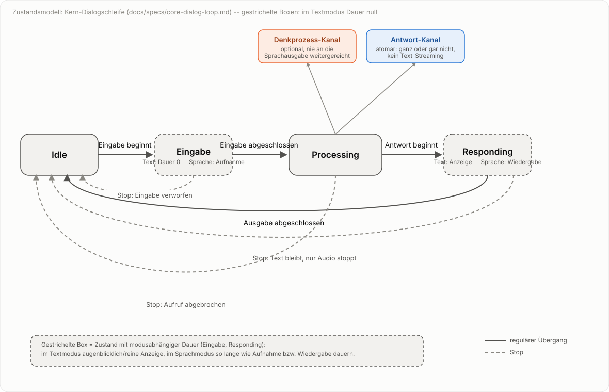
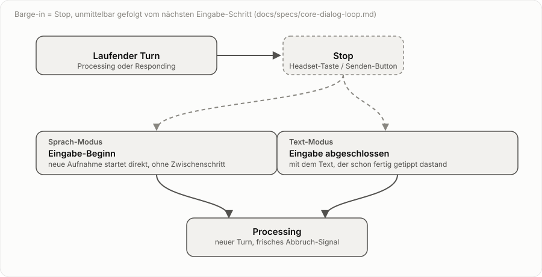

# Spezifikation: Kern-Dialogschleife

Status: Final für den hier beschriebenen Teil (2026-10-02) -- Umsetzung
dagegen teilweise noch offen, siehe Prüfung/Lücken-Liste in der Diskussion,
die zu dieser Spec geführt hat (und ggf. docs/backlog.md).

Dies ist die erste einer Reihe von Feature-Spezifikationen, die
`docs/specification.md` (grobe Feature-Übersicht) schrittweise ablösen bzw.
vertiefen sollen. Diese hier beschreibt den kleinstmöglichen, modusunabhängigen
Kern: die Dialogschleife, bevor irgendeine Sprachfunktion dazukommt. Alle
weiteren Specs (Spracherkennung als Eingabe-Adapter, Sprachausgabe als
Ausgabe-Adapter, Barge-in, Mehrfach-Oberflächen, Agenten-Backends, ...) bauen
auf dem hier definierten Modell auf.

## 1. Zweck

Die Dialogschleife beschreibt, wie eine einzelne Nutzer-Eingabe zu einer
Agenten-Antwort wird -- unabhängig davon, ob Eingabe/Ausgabe als Text oder als
Sprache realisiert sind. Ziel dieser Spec ist, ein Modell zu haben, das für
reinen Text-Chat vollständig ist und sich für Sprache nur um Adapter
erweitert, ohne dass sich der Kern ändert.

## 2. Geltungsbereich

In Scope: Zustände und Übergänge der Dialogschleife, die Ereignisse, die
Übergänge auslösen, und die Nebenläufigkeits-/Abbruchregeln dafür.

Explizit nicht in Scope (eigene Specs):
- Wie Eingabe als Sprache statt Text erfasst wird (Spracherkennung-Adapter).
- Wie Ausgabe zusätzlich gesprochen statt nur angezeigt wird
  (Sprachausgabe-Adapter).
- Unterschiede zwischen den Oberflächen (Web-Cockpit, Telegram, ggf. CLI).
- Wahl/Wechsel des Agenten-Backends, Session-/Workspace-Verwaltung.

## 3. Zustände

Drei Zustände, pro laufender Konversation:

- **Idle** -- wartet auf eine neue Eingabe. Startzustand.
- **Processing** -- die Eingabe wurde übergeben, der Agent arbeitet an einer
  Antwort. Kann mehrere Sekunden dauern. Erzeugt dabei bis zu zwei
  Ausgabe-Kanäle:
  - **Antwort-Kanal**: die eigentliche, finale Antwort. Entscheidung
    (2026-10-02): kommt atomar an -- entweder vollständig da oder noch gar
    nicht, kein Streaming einzelner Textstücke. Echtes Antwort-Streaming ist
    bewusst ausgeklammert, siehe Abschnitt 7.
  - **Denkprozess-Kanal** (optional): Zwischenausgaben des Agenten
    ("thinking"), nicht Teil der eigentlichen Antwort. Verifiziert
    (2026-10-02): beide Backends liefern intern bereits einen von der
    Antwort unterscheidbaren Reasoning-Kanal -- Claude Agent SDK als
    eigenen `ThinkingBlock`-Typ neben `TextBlock` in der
    `AssistantMessage` (ggf. muss Extended Thinking erst per
    `ThinkingConfig` aktiviert werden), Pi als eigene Block-Typen
    (`thinking`/`toolCall`/`toolResult`) neben `text` im
    JSON-Event-Stream. Kein Backend-seitiger Showstopper also -- aktuell
    verwerfen aber beide Client-Implementierungen (`llm.py`'s `_query()`,
    `pi_agent.py`'s `send()`) alles außer dem reinen Textblock; der
    Denkprozess-Kanal muss dort erst noch durchgereicht statt verworfen
    werden.
  Jede Oberfläche entscheidet selbst, welche der beiden Kanäle sie anzeigt
  und wie. Für die Sprachausgabe gilt hart: nur der Antwort-Kanal, nie der
  Denkprozess-Kanal.
- **Responding** -- die Antwort wird ausgeliefert. Im Text-only-Fall ist das
  praktisch augenblicklich (Text erscheint); sobald ein Sprachausgabe-Adapter
  dazukommt, dauert dieser Zustand so lange wie die Wiedergabe.

Es gibt pro Konversation immer genau einen aktiven Zustand. Eine laufende
Texteingabe durch den Nutzer (Tippen, vor dem Absenden) ist kein eigener
Zustand der Schleife -- sie passiert rein clientseitig; der Zustand wechselt
erst bei "Eingabe abgeschlossen" von Idle nach Processing.

## 4. Ereignisse und Übergänge

- **Eingabe abgeschlossen** (Idle -> Processing): Was dieses Ereignis genau
  auslöst, ist modusabhängig, aber für die Schleife irrelevant -- Text-Modus:
  Absenden (Enter/Button); Sprach-Modus (siehe eigene Spec): zweiter
  Tastendruck beendet Aufnahme, Transkript gilt als abgeschlossene Eingabe.
- **Antwort beginnt** (Processing -> Responding): Der Agent liefert (den
  Anfang) der Antwort.
- **Ausgabe abgeschlossen** (Responding -> Idle): Text vollständig angezeigt
  bzw. (mit Sprachausgabe-Adapter) Wiedergabe fertig.
- **Stop** (-> Idle): das eine universelle Abbruch-Primitiv, unabhängig
  davon, von welcher Oberfläche oder welchem Auslöser es kommt (Headset-
  Taste während Processing/Responding, dedizierter Stop-Button im Cockpit,
  künftig evtl. ein Telegram-Befehl). Wirkung hängt nur davon ab, ob der
  Antwort-Kanal zu diesem Zeitpunkt schon Inhalt hat (siehe "Antwort-Kanal"
  oben, Entscheidung: atomar, kein Streaming):
  - **Antwort-Kanal noch leer** (Stop trifft während Processing, egal ob mit
    oder ohne sichtbaren Denkprozess): Agenten-Aufruf wird abgebrochen, ein
    eventuell bereits gezeigter Denkprozess bleibt unverändert stehen, im
    Chatverlauf wird vermerkt, dass der Nutzer abgebrochen hat (sonst wäre
    nicht erkennbar, warum keine Antwort kam), Übergang nach Idle. Keine
    Sprachausgabe involviert, die hätte ohnehin noch nichts zum Vorlesen
    gehabt.
  - **Antwort-Kanal schon vollständig** (Stop trifft während/nach
    Responding): der Text bleibt wie er ist, **keine Markierung** (Entscheidung
    2026-10-02 -- einmal vollständig angekommen, ist der Stop für die
    Textseite irrelevant, nur die Sprachausgabe für diese Antwort wird noch
    komplett unterdrückt: falls schon am Abspielen, sofort stoppen; falls
    noch nicht gestartet, startet sie gar nicht erst). Übergang nach Idle.

- **Barge-in**: keine eigene dritte Übergangsart, sondern eine Komposition
  aus zwei bereits definierten Schritten -- **Stop**, unmittelbar gefolgt vom
  nächsten Eingabe-Schritt. Was dieser zweite Schritt konkret ist, hängt
  davon ab, ob die neue Eingabe zum Zeitpunkt des Triggers schon vollständig
  vorliegt:
  - **Sprach-Modus**: die neue Eingabe existiert noch nicht, sie wird vom
    Trigger selbst erst begonnen -- Stop, dann **Eingabe-Beginn** (Idle ->
    neue Aufnahme). Eine Oberfläche mit nur einer Taste (Headset-Knopf) löst
    während Processing/Responding diese Folge aus, weil man ja sowieso
    gleich wieder reden will.
  - **Text-Modus** (Entscheidung 2026-10-02): die neue Eingabe liegt zum
    Zeitpunkt des Triggers schon vollständig getippt vor -- Senden während
    Processing/Responding heißt also Stop, direkt gefolgt von **Eingabe
    abgeschlossen** mit genau diesem Text (kein separater
    Eingabe-Beginn-Schritt, da Text keine Aufnahmephase hat, siehe
    Abschnitt 3). Kein eigener Barge-in-Button nötig -- der normale
    Senden-Button übernimmt dieselbe Doppelrolle wie der Headset-Knopf: im
    Leerlauf normaler Rundenstart, während Processing/Responding Barge-in.
    Der bestehende "Nur stoppen"-Button im Cockpit bleibt daneben als reiner
    Stop ohne neue Eingabe bestehen, vergleichbar mit der Stop-Taste an
    einem Radio, die ja auch nicht gleichzeitig wieder aufnimmt.

Text wird in jedem Fall angezeigt, unabhängig davon, ob zusätzlich eine
Sprachausgabe läuft -- das ist eine harte Anforderung, kein Implementierungs-
detail des Sprachausgabe-Adapters.

## 5. Nebenläufigkeit

Zustandswechsel werden unter einer kurzen Sperre geprüft und geklaimt, die
eigentliche (potenziell lange) Verarbeitung läuft außerhalb dieser Sperre in
einem eigenen Thread/Task. Damit kann ein Barge-in-Ereignis jederzeit
ankommen und gesehen werden, statt hinter einer für Sekunden gehaltenen Sperre
zu verhungern. Jeder Turn bekommt beim Übergang Idle -> Processing ein
frisches Abbruch-Signal; ein Barge-in setzt genau dieses Signal, nie ein
veraltetes aus einem vorherigen Turn.

(Das ist die modusunabhängige Essenz dessen, was `app.py`/`on_toggle` heute
bereits für den vollen Sprachdialog umsetzt, mit zusätzlichem Recording-
Zustand für die Sprach-Eingabe.)

## 6. Entscheidungen (ehemals offene Fragen)

- Processing soll im Text-only-Fall sichtbar sein (Entscheidung 2026-10-02),
  z.B. als "Agent denkt nach...", nicht nur intern existieren -- hilfreich
  fürs Nutzungsgefühl, analog zum bereits in Abschnitt 3 beschriebenen
  Denkprozess-Kanal.

Damit sind für diesen Teil (Kern-Dialogschleife, Ausgabe-Kanäle, Stop/
Barge-in) keine offenen Fragen mehr offen; Status oben auf "final" gesetzt.

## 7. Bewusst ausgeklammert

- **Echtes Streaming der finalen Antwort** (Textstücke erscheinen schon,
  während der Agent noch generiert): aktuell liefert `send()`
  (`AgentConversation`) nur den fertigen Antworttext als einzelnen String,
  kein Zwischenergebnis. Diese Spec geht bewusst vom heutigen, atomaren
  Verhalten aus (siehe Abschnitt 3); ein Umbau auf echtes Antwort-Streaming
  wäre eine größere Änderung an der Agenten-Schnittstelle selbst und gehört
  in eine eigene, spätere Spec.
