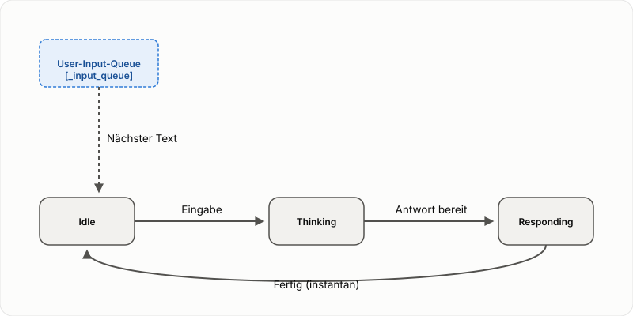

# Spezifikation: Kern-Text-Dialogschleife

Status: Entwurf (2026-10-02) -- basiert auf dem Modellschnitt aus `docs/specs/core-dialog-loop.md`, fokussiert aber rein auf die Text-Logik und Queue-Verarbeitung.

Diese Spezifikation beschreibt das fundamentale Modell der Dialogführung in `speech-to-speech`, reduziert auf den Text-Kanal. Dies bildet das Fundament, auf dem die Sprach-Erweiterung (STT/TTS) aufbaut.

## 1. Zustandsmodell (Text-only)

Im reinen Text-Modus (z.B. Cockpit ohne Audio) gibt es drei logische Zustände:

- **Idle**: Das System wartet auf Eingaben.
- **Thinking (Processing)**: Ein User-Input wird verarbeitet. Der Agent generiert Text und Metadaten (Denkprozess).
- **Responding**: Die finale Text-Antwort wird im Chatverlauf angezeigt.

Im Text-Modus ist der Übergang von **Thinking** nach **Responding** sowie von **Responding** nach **Idle** praktisch instantan, da keine zeitintensive Wiedergabe erfolgt.

## 2. Die User-Input-Queue

Das System verfügt über eine zentrale Eingabe-Queue (`_input_queue` in `app.py`). Alle Benutzereingaben (Text-Input aus dem Cockpit oder Transkripte von der Sprach-Erweiterung) landen in dieser Queue.

### Verhalten bei neuen Eingaben:

1.  **System ist Idle**: Die Eingabe wird sofort aus der Queue genommen, der Zustand wechselt nach **Thinking**, und die Verarbeitung beginnt.
2.  **System ist Busy (Thinking/Responding)**: Die neue Eingabe wird am Ende der Queue angehängt. Die laufende Verarbeitung wird **nicht** unterbrochen. Sobald der aktuelle Turn beendet ist (Idle erreicht), prüft der "Responder Loop", ob weitere Elemente in der Queue sind, und startet den nächsten Turn.

## 3. Queue-Events und Visualisierung

| Event | Zustand vorher | Aktion | Zustand nachher |
| :--- | :--- | :--- | :--- |
| User sendet Text | Idle | Text -> Queue, Loop startet | Thinking |
| User sendet Text | Thinking | Text -> Queue | Thinking (bleibt) |
| Agent liefert Antwort | Thinking | Antwort -> Chat | Responding -> Idle (sofort) |
| Stop-Button | Thinking | LLM-Call Abbruch, Queue löschen | Idle |

## 4. Steering (Steuerung laufender Turns)

Da das System mehrere Eingaben in der Queue halten kann, ergibt sich ein "Steering"-Effekt: Wenn der Nutzer eine zweite Frage stellt, während die erste noch verarbeitet wird, dient die erste Antwort (sobald fertig) als Kontext für die zweite Verarbeitung. Dies geschieht automatisch durch das synchrone Abarbeiten der Queue im Responder-Loop.

## 5. Agent-Output-Kanäle (Text)

Wie in `docs/specs/thinking-channel-and-stop-marker.md` definiert, produziert der Agent während der **Thinking**-Phase zwei Arten von Text-Output:

- **Denkprozess-Kanal (Metadata)**: Live-Updates über den Fortschritt, Tool-Aufrufe etc.
- **Antwort-Kanal (Final String)**: Die eigentliche Antwort, die am Ende des Turns geliefert wird.
