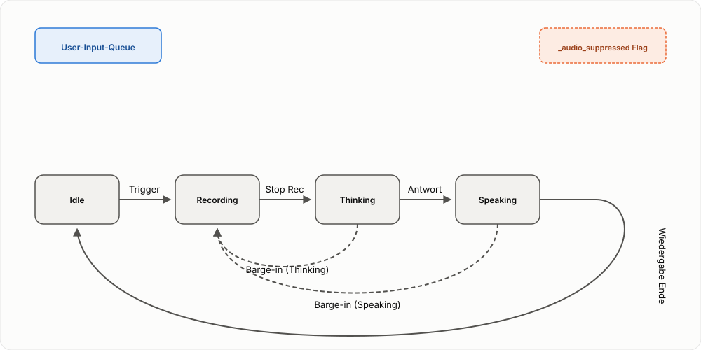

# Spezifikation: Sprach-Erweiterung (STT/TTS)

Status: Entwurf (2026-10-02) -- Ergänzung zur `docs/specs/core-text-dialog-loop.md`.

Diese Spezifikation beschreibt, wie die Kern-Dialogschleife um Spracherkennung (STT) und Sprachausgabe (TTS) erweitert wird, und wie die verschiedenen Queues und Zustände dabei interagieren.

## 1. Erweiterte Zustände

Die Sprach-Erweiterung führt zwei zeitintensive Phasen ein, die das Zustandsmodell erweitern:

- **Recording**: Aktive Aufnahme des Nutzers (Ersatz für den instantanen Text-Input-Schritt).
- **Speaking**: Aktive Sprachausgabe der Agenten-Antwort (Erweiterung der Responding-Phase).

### Vollständiges Zustandsdiagramm

1.  **Idle** --(Trigger Start)--> **Recording**
2.  **Recording** --(Trigger Stop)--> **Thinking** (Transkript -> User-Input-Queue)
3.  **Thinking** --(Antwort bereit)--> **Speaking** (Antwort -> TTS-Output-Queue)
4.  **Speaking** --(Wiedergabe fertig)--> **Idle**

## 2. Die Queues im Sprach-Modus

Es gibt nun zwei interagierende Queues/Steuerungsmechanismen:

1.  **User-Input-Queue**: (siehe Core Text Model) Hält die zu verarbeitenden Texte.
2.  **TTS-Ausgabe**: Da die Sprachausgabe blockierend erfolgt, wirkt sie als "Bremse" für den Responder-Loop.

## 3. Interaktionen und Events

### Barge-in (Unterbrechung durch den Nutzer)
Ein Barge-in tritt auf, wenn der Nutzer den Trigger betätigt, während das System in **Thinking** oder **Speaking** ist.

**Ablauf bei Barge-in:**
1.  **Zustand**: Sofortiger Wechsel nach **Recording**.
2.  **Audio-Stop**: Ein Signal wird an den TTS-Daemon gesendet, um laufende Ausgaben sofort abzubrechen.
3.  **Audio-Suppression**: Ein Flag (`_audio_suppressed`) wird gesetzt. Alle noch ausstehenden oder im Hintergrund fertiggestellten Turns dieses Zyklus werden **nicht** mehr vorgelesen.
4.  **Steering**: Der laufende **Thinking**-Prozess (LLM) wird **nicht** abgebrochen. Er läuft im Hintergrund zu Ende und die Antwort wird im Chatverlauf (Text) hinterlegt, aber nicht gesprochen.
5.  **Neuer Turn**: Sobald die neue Aufnahme beendet wird, landet das neue Transkript in der User-Input-Queue hinter dem (vielleicht noch laufenden) Hintergrund-Turn.

### Queue-Verhalten bei Barge-in Visualisierung

| Zeitpunkt | System-Status | User-Input-Queue | Audio-Status |
| :--- | :--- | :--- | :--- |
| T0: Turn 1 läuft | Thinking | [ ] | Stumm (noch) |
| T1: Barge-in | Recording | [ ] | TTS Stop, Suppression=ON |
| T2: Turn 1 fertig | Recording | [ ] | Audio übersprungen (Suppression) |
| T3: Aufnahme Stop| Thinking (Turn 2) | [Transkript 2] | Suppression=OFF (für Turn 2) |

## 4. TTS-Daemon Queue
Der TTS-Daemon selbst verarbeitet Anfragen seriell. Ein `speak`-Kommando blockiert die Verbindung, bis die Wiedergabe fertig oder abgebrochen ist. Ein `stop`-Kommando über eine separate Verbindung setzt ein Event im Daemon, das die laufende Wiedergabe (meist innerhalb von < 100ms) abbricht.

**Präzisierung (2026-10-03):** "Seriell" heißt hier konkret nur eine
Belegt-Sperre (`_claim_speaking()` in `tts_daemon/daemon.py`) -- eine zweite
Anfrage, während schon gesprochen wird, wird sofort mit einem Fehler
abgelehnt, nicht gepuffert. Heute konkurrieren Antwort-Audio und
Denkprozess-Audio unkoordiniert um diese Sperre und können sich gegenseitig
mit verworfener (nicht nachgeholter) Audio-Ausgabe ausstechen. Die fehlende
echte Warteschlange auf `App`-Seite, die das behebt, sowie die zugehörige
Ordnungsinvariante zwischen STT und TTS, sind jetzt eigenständig
spezifiziert: 👉 **[Spezifikation: TTS-Ausgabe-Warteschlange](tts-output-queue.md)**.

## 5. Besonderheiten des Responder-Loops
Der Responder-Loop in `app.py` ist der zentrale Orchestrator. Er:
- Wartet auf das Ende der TTS-Wiedergabe, bevor er den nächsten Turn aus der `_input_queue` nimmt.
- Bricht diese Wartezeit sofort ab, wenn ein Barge-in das TTS-Signal auf `stop` setzt.
- Stoppt sich selbst, wenn der Zustand auf **Recording** wechselt, um keine Turns zu starten, während der Nutzer noch spricht.
